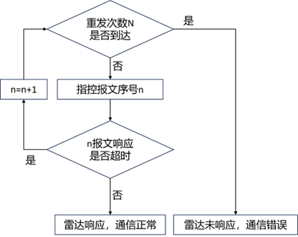

# RadarControlCenter
雷达控制中心仓库
包括两个任务
- 雷达配置
- 雷达显示

## 雷达配置：

### 功能需求：

1. 雷达状态查询
2. 参数配置与查询
3. 任务模式控制


4. 通信与重发

    + 下达命令报文

    + 接受状态报文


## 需要支持的报文

+ 任务控制：待机 0x1003、搜索 0x1004、跟踪 0x1005、展开/撤收 0x1008；均需处理 0xF000 的执行结果回传。

- 参数配置/反馈
    - 静默区 0x2091/0x2092（起点/终点：0~36000，单位 0.01°）
    - IP 配置 0x2081/0x2082（广播下发，批量/指定 DSP 模式、IP/Mask/GW/Port 字段；雷达重启后生效）
    - 位置/误差补偿 0x2011/0x2012 + 误差补偿（经纬高与航向/俯仰/滚转、系统方位/俯仰/距离补偿等）
- 查询机制：使用“雷达参数查询报文”填写“待查询报文ID”，例如填 0x2092 即返回静默区反馈
- 只读状态订阅：解析 0x3002 状态报文，在 UI 底部滚动显示工作状态/故障位/频点/天线模式/静默区等（协议里写了高频上传，联调时以实际为准）

### 最小交互界面：

+ 连接设置：

    + 设置本机监听端口、目标雷达ip/端口（可以有多个？）

    + 超时、重发等等的策略配置

        

+ 任务控制：

    + 待机/搜索/跟踪/展开-撤收等功能的切换按钮
    + 雷达跟踪任务的控制？
    + 历史控制指令和应答结果的日志显示

+ 参数查询（只读）：

    查询当前参数/状态，以表格等方式显示（？）

    底部状态条实时显示 0x3002 关键字段

    

+ 参数配置页签：

    + 静默区
    + 雷达IP 配置
    + 位置/误差补偿
    + 待补充

    

+ 对上述字段的校验与单位细节处理

+ 待补充

## 雷达显示：
1. 接收数据
2. 将每个目标的距离和相位差转换为屏幕上的X, Y坐标
3. 绘制当前的所有目标
4. 绘制历史轨迹
5. 自动管理历史轨迹数据，移除过旧的帧，保持固定的历史长度
6. 调用 ui->qwtPPI->replot() 刷新屏幕，实现动态显示

### 模拟JSON格式说明：
#### 示例：
```
{
  "radar": {
    "maxRange": 2000,
    "targets": [
      {
        "id": 1,
        "angle": 123.5,
        "distance": 1500.0,
        "speed": 10.2,
        "heading": 250.0,
        "latitude": 30.0001,
        "longitude": 120.0001,
        "type": 1
      },
      {
        "id": 2,
        "angle": 240.0,
        "distance": 800.0,
        "speed": 12.5,
        "heading": 100.0,
        "latitude": 30.0050,
        "longitude": 120.0050,
        "type": 2
      }
    ]
  }
}
```
#### 说明：
- radar.maxRange：整个雷达的最大探测距离（单位：米）。
- targets：目标数组，每个元素代表一个目标点。
-  id：目标唯一编号（用于区分目标）。
- angle：目标相对雷达的方位角（单位：度，0–359，0 表示正北或正前）。
- distance：目标与雷达的直线距离（单位：米）。
- speed：目标速度（单位：m/s）。
- heading：目标航向角（单位：度，0–359，方向参考与 angle 一致）。
- latitude：目标位置的纬度（单位：°）。
-  longitude：目标位置的经度（单位：°）。
-  type：目标类型（整数，固定不变，用来区分颜色/种类）。
    -  1 = 无人机（红色）
    - 2 = 直升机（黄色）
    - 3 = 民航机（蓝色）
